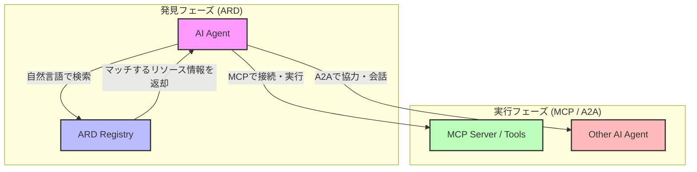
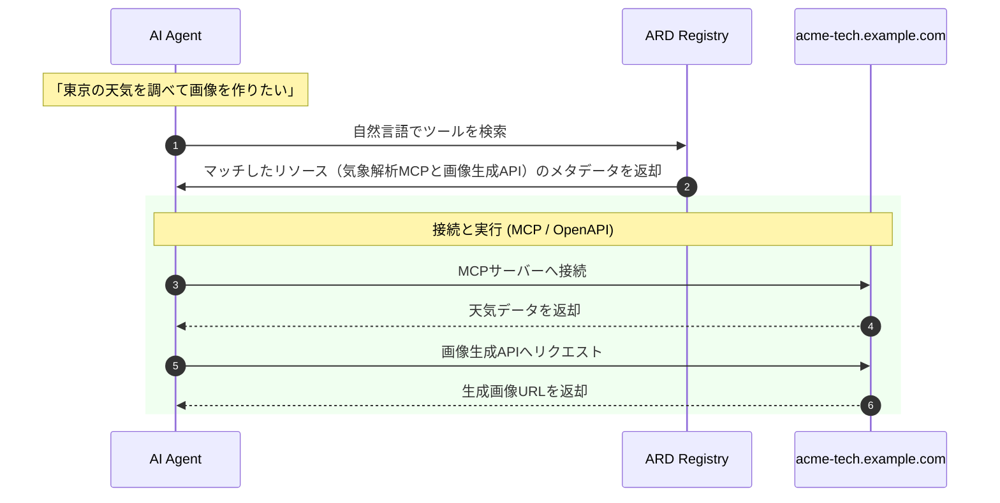

# はじめに

近年、AIエージェント（Agent）の進化が目覚ましいものとなっています。エージェントは自ら考え、ツールを使い、他のエージェントと協力しながらタスクを遂行します。
しかし、エージェントが「使える道具（ツール）」や「協力できる仲間（他のエージェント）」をどうやって見つけるかという点において、現在ある大きな課題が存在しています。

現状、多くのエージェントシステムでは、利用可能なツールや接続先が開発者によって手動でハードコーディングされています。これはインターネットの黎明期に、Webサイトにアクセスするために手動でディレクトリ一覧を引いたり、IPアドレスを直接指定していた時代に似ています。

この課題を解決するために、Google、Microsoft、Hugging Faceなどのメンバーによって共同で策定が進められている新しいオープン仕様が **ARD (Agentic Resource Discovery)** です。

本記事では、このARDがどのようなものであり、なぜ必要なのか、精度と拡張性に優れたシステムをいかに構築するかについて、図やサンプルコードを交えて分かりやすく解説します。

---

# 現状の課題：手動設定の限界とコンテキストの肥大化

エージェントに外部システムやツール（Web検索、データベース、特定のAPIなど）を使わせる場合、現在一般的に行われているアプローチには以下のような深刻なペインポイントがあります。

### 1. 開発者の「手動設定」への依存
エージェントが利用するツールのエンドポイント（URLやAPIキーなど）は、開発時にハードコーディングされるか、静的な設定ファイルに記述されています。ツールが新しく追加されたり変更されたりするたびに、システムの再デプロイやコードの書き換えが必要となり、スケールしません。

### 2. LLMのコンテキスト制限と「迷子」問題
LLMにツールを使わせるためには、システムプロンプトやコンテキストウィンドウに、すべてのツールの機能説明（Tool Description）をあらかじめ流し込んでおく必要があります。
しかし、使えるツールが数十、数百と増えていくと、以下のような問題が発生します。
- **トークン消費（コスト）の増大**
- **LLMの推論精度の低下（Attentionの分散）**: 選択肢が多すぎると、LLMが適切なツールを正しく選択できなくなったり、指示を無視する確率が上がります（いわば「道具が多すぎて迷子になる」状態）。

---

# ARD（Agentic Resource Discovery）とは？

**ARD (Agentic Resource Discovery)** は、エージェントが「どのようなリソース（ツール、エージェント、APIなど）が存在し、それらがどこにあり、信頼できるものなのか」を**動的に発見（検索）するための標準プロトコル仕様**です。

いわば、**「AIエージェントのための分散型検索エンジン 兼 DNS」**と言えます。

ARDの導入により、エージェントは起動時にすべてのツール仕様を把握しておく必要がなくなります。タスクを実行する過程で「〇〇を実行できるツールが必要だ」と判断した時点で、ARDを介して動的にツールを検索し、その場で接続して利用することが可能になります。

---

# ARD・MCP・A2Aの「プロトコル3兄弟」

エージェントエコシステムには、ARDのほかに **MCP (Model Context Protocol)** や **A2A (Agent-to-Agent)** といったプロトコルが存在します。これらは競合するものではなく、それぞれの役割を持つ**相補的なプロトコル**です。

それぞれの役割分担は以下のようになります。

| プロトコル | フェーズ | 役割・機能 |
| :--- | :--- | :--- |
| **ARD** | **発見 (Discovery)** | どのようなリソース（MCP、A2A、API）が存在し、どこにあり、安全かを**見つける**。 |
| **MCP** | **実行 (Tools)** | 見つけたデータソースやツールに、エージェントがどうやって接続し**実行するか**を定義する。 |
| **A2A** | **実行 (Agents)** | 見つけた他のエージェントと、どうやって通信し**共同作業するか**を定義する。 |

それぞれの関係を図示すると、以下のようになります。



---

# 仕組みと `ai-catalog.json`

ARDの中心にあるのが、**`ai-catalog.json`** というマニフェストファイルです。これはWebサイトでいう `sitemap.xml` や、Webサービス提供時の `.well-known/` 構成に似ています。

### 1. 分散配置と信頼モデル
ツールやエージェントを提供する組織（Publisher）は、自身の所有するドメインの配下に、以下のようなURLでカタログファイルを公開します。
`https://example.com/.well-known/ai-catalog.json`

ドメイン直下に公開することで、**「そのドメインの所有者が公式に提供しているツールである」という暗号的な信頼性（Identity & Trust）**が担保されます。

### 2. `ai-catalog.json` の記述例
以下は、ある組織が提供しているMCPサーバーやAPIツールを宣言する `ai-catalog.json` のシンプルな実装サンプルです。

```json
{
  "specVersion": "1.0",
  "host": {
    "displayName": "アクロ・テック社",
    "identifier": "did:web:acme-tech.example.com"
  },
  "entries": [
    {
      "identifier": "urn:air:acme-tech.example.com:mcp:weather-service",
      "displayName": "地域気象データ解析ツール",
      "type": "application/mcp+json",
      "url": "https://mcp.acme-tech.example.com",
      "description": "日本国内の主要都市のリアルタイムな気象観測データおよび3日間の天気予報を取得・解析するためのMCPサーバー。"
    },
    {
      "identifier": "urn:air:acme-tech.example.com:api:image-generator",
      "displayName": "AI画像生成API",
      "type": "application/openapi+json",
      "url": "https://api.acme-tech.example.com/openapi.json",
      "description": "テキストプロンプトを元に高品質なマーケティング画像を生成するOpenAPI準拠のサービス。"
    }
  ]
}
```

#### 主なキーの解説:
- **`specVersion`**: ARDの仕様バージョンを示します。
- **`host`**: リソース提供者の情報。`identifier` にはWebドメインを元にした分散型ID（DID）などが使われます。
- **`entries`**: 提供するリソースの配列。
  - `type`: `application/mcp+json` や `application/openapi+json` などを指定し、どのプロトコルで呼び出すべきかを示します。
  - `url`: 接続先やAPIスキーマのURL。
  - `description`: 検索エンジン（Registry）やエージェントが、ツールが必要かどうかを判断するための詳細な説明文。

### 3. 発見から呼び出しまでのプロセス

ARD RegistryがWeb上の `ai-catalog.json` を巡回して情報を収集（クロール）しておくことで、エージェントはいつでも自然言語で必要なリソースを探し出せるようになります。

この「自然言語による検索」の裏側では、以下のような**セマンティック検索（意味検索）**の仕組みが働いています。

1. **事前インデックス化**: Registryは各ドメインの `ai-catalog.json` を巡回し、ツールの説明文（`description`）を「意味を表す数値ベクトル」に変換してデータベースに格納しておきます。
2. **検索クエリの意味解析**: エージェントが送信した「天気を調べて画像を生成したい」という曖昧な要望も、同様にベクトルデータに変換されます。
3. **意味ベースのマッチング**: クエリと登録ツールの説明文の類似度を計算し、言葉が完全一致していなくても、最も意図に近いツールの接続情報（メタデータ）を自動的に引き当ててエージェントに返却します。

さらに、エージェントシステム側がこの検索を実行する（トリガーを引く）プロセスには、主に以下の2つの設計アプローチがあります。

*   **エージェント自身が判断して検索する（Agent-Driven方式）**:
    エージェント（LLM）にあらかじめ「Registryを検索するための検索ツール（API）」を認識させておきます。LLMがタスクを処理する過程で「手持ちのツールでは解決できない」と判断したタイミングで、自発的に検索ツールをコールして必要なリソースを引き当てます。
*   **システムが裏で事前に検索する（System-Driven方式 / ルーター方式）**:
    メインのLLMを起動する前に、エージェントの実行エンジン（LangChainやLlamaIndexなどのフレームワーク）がユーザー入力をRegistryに投げて自動検索します。ヒットした該当ツールのメタデータのみをシステムプロンプトに動的に注入してLLMを起動するため、LLMが多くのツール説明で混乱するのを防ぐことができます（Search-Firstアプローチ）。

以下は、この検索から実際のツール実行（MCP/OpenAPIなどによる接続）までの処理フローです。



---

# ARDがもたらす3つの革新（メリット）

### 1. 「Search-First（検索優先）」によるTokenの劇的節約
これまでのようにLLM of システムプロンプトへ全てのツール定義をあらかじめ書き込む必要がありません。
「必要な時に、必要なものだけを検索して、エージェントのコンテキストに追加する」というアプローチをとるため、コンテキストウィンドウが不要に肥大化せず、APIコストの削減とLLMの回答精度の向上を同時に達成できます。

### 2. システム開発の完全なデカップリング（疎結合化）
エージェントのコードベース側を変更することなく、新しいツール（MCPサーバー）や、特定の作業に特化した専門エージェントを動的に追加できます。
自社ドメインの `ai-catalog.json` に1行追加するだけで、既存のエージェントたちが自動的にそのツールを認知し、使い始めるようになります。

### 3. 企業の枠を超えたエコシステム連携（Webのオープン性）
ARDはオープンなWeb標準を目指して策定されています。
自社内のツールだけでなく、インターネット上に公開されている安全なサードパーティ製ツールや他の企業のエージェントを、安全に検索・統合することが可能になります。ドメインに紐づいた認証があるため、「なりすまし」や「不正なツールの実行」を防止できます。

---

# おわりに

現在のAIエージェント開発は、いわば「閉じたローカルな環境」に依存しています。しかし、ARD（Agentic Resource Discovery）の登場によって、エージェントは自律的にWebを探索し、必要な機能を見つけ出し、組み立てる手段を手に入れつつあります。

MCPが「道具の繋ぎ方」を決めたとすれば、ARDは「道具の探し方」を決めるものです。これらが組み合わさることで、真の意味での「自律型AIエージェントのネットワーク（Internet of Agents）」が現実のものになっていくでしょう。

ぜひ、皆さんのプロジェクトでも `.well-known/ai-catalog.json` の設計と、ARDを活用した動的なエージェント構築を検討してみてはいかがでしょうか。

---
*本記事は、最新のARD (Agentic Resource Discovery) 草案仕様（v0.9）をベースに解説しています。仕様は今後のアップデートにより変更される可能性があります。*
