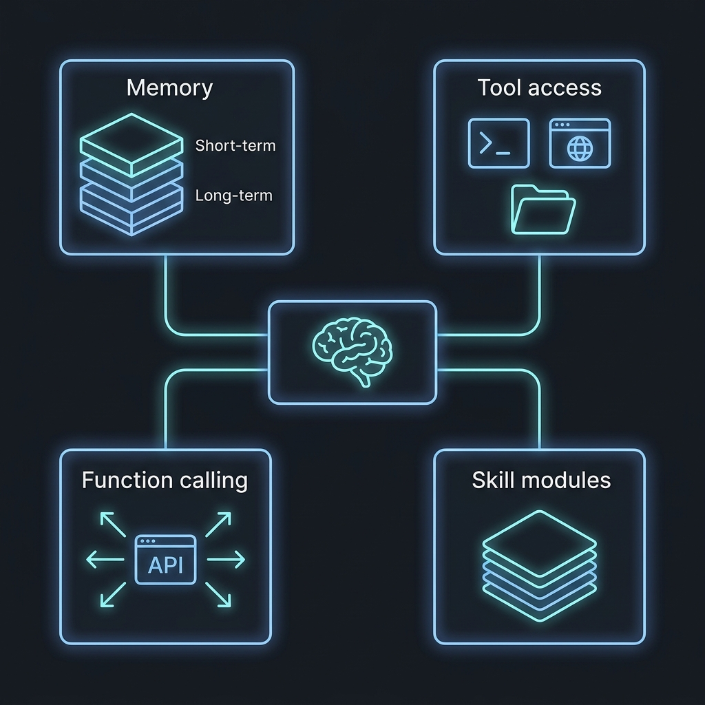

# AIエージェントの中身を覗く——Memory・Tool・Skill、LLMとの協調の仕組み


ChatGPTに「明日の会議をリマインドして」と頼んでも、何も起きない。カレンダーAPIを叩く手段がないから当然です。

でもOpenClawやClaude Code、Hermes Agentのような「AIエージェント」に同じことを頼むと、実際にカレンダーに予定が入る。ファイルを読み書きし、ターミナルでコマンドを実行し、ブラウザを操作し、翌朝にはSlackでリマインドまで飛ばしてくる。

この差はどこから生まれるのか。

答えは「LLMの賢さ」ではなく、LLMの周囲に組まれた **Memory・Tool・Function Calling・Skill** という4つの仕組みにあります。LLM単体はあくまで「言葉を生成する頭脳」であり、エージェントはその頭脳に「記憶」「手足」「業務マニュアル」を接続した統合システムです。

この記事では、OpenClawを主な具体例に使いながら、AIエージェントの内部構造を分解して解説します。

---

## 1. 全体像：エージェントは「ループ」で動く



まず大前提として、AIエージェントはチャットボットとは根本的に動作原理が違います。チャットボットは「質問→回答」の1往復で完結する。エージェントは違う。

エージェントの心臓部は「エージェントループ」と呼ばれる制御ループです。

```
┌─→ 状態を読む（Memory・環境情報を取得）
│        ↓
│   LLMに考えさせる（次にやるべきことを判断）
│        ↓
│   行動する（Toolを呼び出す / Function Callingを実行）
│        ↓
│   結果を観察する（ツールの出力を確認）
│        ↓
│   Memoryを更新する（学んだことを記録）
│        ↓
└── タスク完了？ → No: ループ先頭に戻る
                 → Yes: ユーザーに結果を返す
```

この「考える → 行動する → 観察する → 繰り返す」のサイクルは、学術的にはReActパターンと呼ばれています。重要なのは、LLMは「考える」部分だけを担当しているということ。残りの「行動する」「観察する」「記憶する」はすべてLLMの外側にある仕組みが処理する。

ここからは、その「外側の仕組み」を一つずつ見ていきます。

---

## 2. Memory：エージェントの「記憶」


LLMには致命的な欠点が一つあります。生まれつき記憶がない。

正確に言うと、LLMのコンテキストウィンドウ（入力できるテキストの上限）が「ワーキングメモリ」に相当しますが、会話が終わればすべて消える。次の会話では白紙に戻る。

エージェントはこの問題を「外部メモリシステム」で解決しています。

### 2.1 メモリの3層構造

現代のAIエージェントは、人間の記憶と似た階層構造を持っています。

| 層 | 名称 | 役割 | 寿命 |
|----|------|------|------|
| 第1層 | ワーキングメモリ | 今のタスクに必要な直近の文脈 | 会話中のみ |
| 第2層 | エピソード記憶 | 過去の対話ログ、行動履歴 | 日〜週単位で蓄積 |
| 第3層 | 長期記憶 | ユーザーの好み、学習済みの知識、蒸留されたインサイト | 永続 |

### 2.2 OpenClawの場合

OpenClawはファイルベースの記憶システムを採用していて、構造がとても分かりやすい。

```
~/.openclaw/workspace/
├── SOUL.md       ← エージェントの人格・行動ルール・境界線
├── AGENTS.md     ← 運用プレイブック（セッション管理、安全ルール）
├── MEMORY.md     ← 長期記憶（蒸留されたインサイト）
└── 2026-04-18.md ← 日次ログ（その日の全イベント、追記専用）
```

`SOUL.md` が人格の定義、`MEMORY.md` が長期記憶、日付ファイルがエピソード記憶。全部markdownファイルなので、ユーザーが直接エディタで開いて中身を見たり編集できる。

自分が最初にOpenClawを触ったとき、`MEMORY.md` を開いて「こいつ、昨日の会話からこんなこと学んでたのか」と驚いた覚えがあります。ファイルベースなので、何を記憶しているか全部見えるのは安心感がある。ブラックボックスじゃない。

### 2.3 なぜ外部メモリが必要なのか

「コンテキストウィンドウが100万トークンもあるなら、全部突っ込めばいいのでは？」と思うかもしれません。でもそれは非現実的です。

- コスト: トークン数に比例してAPI料金が増える
- 速度: コンテキストが長いほどレスポンスが遅くなる
- 精度: 長すぎるとLLMは中間部分の情報を「忘れる」（Lost in the Middle問題）

だから外部メモリで「今必要な情報だけ」をコンテキストに注入する方が、速くて安くて正確。

---

## 3. Tool：エージェントの「手足」

LLMは言葉を生成するだけで、外の世界に触ることができない。Toolは、LLMに「手足」を与える仕組みです。

### 3.1 代表的なTool

OpenClawの場合、以下のようなToolが組み込まれています。

| Tool | できること |
|------|----------|
| Shell実行 | ターミナルコマンドの実行（`git`, `npm`, `curl` 等） |
| ファイルシステム | ローカルファイルの読み書き・検索 |
| ブラウザ制御 | Chrome DevTools Protocol経由でWebページを操作 |
| Cronスケジューリング | 定周期タスクの設定・実行 |
| メモリ操作 | 記憶の保存・検索・削除 |

### 3.2 Toolの実装はただの関数

技術的な実態を言うと、Toolは「名前」「説明文」「入力スキーマ」「実行コード」を持つ関数です。

```python
# Toolの定義例（概念コード）
tool_definition = {
    "name": "read_file",
    "description": "指定パスのファイル内容を読み取って返す",
    "parameters": {
        "type": "object",
        "properties": {
            "path": {
                "type": "string",
                "description": "読み取るファイルのパス"
            }
        },
        "required": ["path"]
    }
}

# 実際に実行される関数
def read_file(path: str) -> str:
    with open(path, "r") as f:
        return f.read()
```

LLMは、この「name」と「description」を見て「あ、ファイルを読みたいときはこのToolを使えばいいんだな」と判断する。LLMが直接Pythonコードを実行するわけじゃない。LLMは「`read_file` を `path="/home/user/todo.md"` で呼んでくれ」というJSON指示を出力するだけ。実際にファイルを開くのはエージェントフレームワーク側の仕事です。

---

## 4. Function Calling：LLMと外部世界の「通訳」

Toolが「手足」なら、Function Callingは「LLMの意図を手足に翻訳するプロトコル」です。

### 4.1 仕組み

通常のチャットでは、LLMの出力は自然言語テキスト。Function Callingモードでは、LLMは自然言語の代わりに「構造化されたJSON」を出力します。

```
通常モード:
  ユーザー: 「今日の天気は？」
  LLM出力: 「申し訳ありませんが、リアルタイムの天気情報にはアクセスできません。」

Function Callingモード:
  ユーザー: 「今日の天気は？」
  LLM出力: {
    "tool": "get_weather",
    "arguments": { "location": "Tokyo", "date": "2026-04-18" }
  }
```

LLMが「自分でデータを持っていない → Toolを使うべきだ」と判断し、「どのToolを、どの引数で呼ぶか」をJSONで出力する。これがFunction Callingの正体です。

### 4.2 実際の流れ

エージェントの1ターンを時間軸で追うとこうなります。

```
1. ユーザー入力をLLMに送信（Toolの定義リストも一緒に渡す）
      ↓
2. LLMが判断：
   - テキストで答えられる → 通常のテキスト応答を返す
   - Toolが必要 → Function Call（JSON）を返す
      ↓
3. フレームワークがJSONを解析し、該当するToolを実行
      ↓
4. Toolの実行結果をLLMに戻す
      ↓
5. LLMが結果を解釈し、最終応答を生成
   （または、さらに別のToolを呼ぶ → ステップ2に戻る）
```

ちなみに、このFunction Callingの信頼性がエージェントの品質を大きく左右します。LLMが「引数を間違える」「存在しないToolを呼ぼうとする」「Toolを使うべき場面でテキスト応答してしまう」——こういった失敗が実運用では頻繁に起きる。正直、ここが2026年でもまだ一番不安定なところです。

---

## 5. Skill：エージェントの「業務マニュアル」

Memory・Tool・Function Callingが揃っても、エージェントは「何をすべきか」を知らない。「手足はあるけど、仕事の手順を知らない新人」と同じ状態。

Skillはこの問題を解決する仕組みです。

### 5.1 Skillとは

SkillはToolとは違います。Toolは「一つの動作」（ファイルを読む、コマンドを実行する）を定義するのに対し、Skillは「複数のToolを組み合わせた業務手順」を定義するもの。

| 概念 | 比喩 | 例 |
|------|------|-----|
| Tool | ハンマー、ドライバー等の工具 | `read_file`, `run_shell`, `browser_navigate` |
| Skill | 「棚の組み立て手順書」 | 「Zenn記事の執筆→画像生成→Git公開」の手順全体 |

### 5.2 OpenClawでのSkill

OpenClawでは、Skillは `SKILL.md` というmarkdownファイルで定義されます。

```markdown
# Skill: 毎朝のニュースダイジェスト

## トリガー
毎朝7:00にHEARTBEAT経由で自動起動

## 手順
1. RSS Feedから主要テックメディアの最新記事を取得（browser tool）
2. 各記事の要約をLLMで生成
3. 重要度で並び替え
4. Markdownでダイジェストを生成し、MEMORY.mdに保存（file tool）
5. Telegramでユーザーに送信（messaging tool）
```

ここが面白いのは、SkillはLLMに対する「プロンプト」として機能するということ。Skillファイルの中身はLLMのコンテキストに注入され、LLMは書かれた手順に従ってToolを呼び出す。コードを書く必要はなく、自然言語で手順を定義するだけ。

実際にこの仕組みでZennの記事執筆Skillを作ったことがあるのですが、Skillファイルを書き換えるだけでワークフローが変わるのは想像以上に便利でした。コードのデプロイが不要なので、試行錯誤のサイクルが速い。

---

## 6. 4つの要素はどう協調するのか

ここまでの4要素を統合して、エージェントが「カレンダーに予定を追加して」という一つのリクエストを処理する流れを見てみましょう。

```
[ユーザー]:「明日の10時に田中さんとの打ち合わせをカレンダーに入れて」

     ↓ ① Memory から文脈を取得
         → 長期記憶を検索:「田中さん = 田中太郎、tanaka@example.com」
         → ワーキングメモリ:「明日 = 2026-04-19」

     ↓ ② LLMに送信（Tool定義 + Skill手順 + Memory + ユーザー入力）
         → LLMが判断:「calendar_create_event を呼ぶべき」

     ↓ ③ Function Calling で JSON を出力
         → { "tool": "calendar_create_event",
              "arguments": {
                "title": "田中太郎さんとの打ち合わせ",
                "date": "2026-04-19T10:00:00",
                "attendees": ["tanaka@example.com"]
              }
            }

     ↓ ④ フレームワークが Tool を実行
         → Google Calendar APIに予定を作成

     ↓ ⑤ 結果をLLMに戻す
         → LLMが最終応答を生成:
           「明日4/19の10時に田中太郎さんとの打ち合わせを登録しました」

     ↓ ⑥ Memory を更新
         → 日次ログに記録:「2026-04-18: カレンダー予定を作成」
```

Memory・Tool・Function Calling・Skillの4つが噛み合って初めて、「LLMが考え、実世界で行動する」エージェントが成立する。どれか一つでも欠ければ、単なるチャットボットに戻ってしまう。

---

## 7. 手を動かしてみる：OpenClawのセットアップ

理屈だけだと掴みにくいので、実際に動かしてみましょう。OpenClawはセルフホスト型なので、自分のマシンで動きます。

```bash
# インストール（Node.js 20+ 必要）
npx openclaw@latest init

# ワークスペースの初期化
cd ~/.openclaw/workspace

# SOUL.md（人格定義）を確認・編集
cat SOUL.md

# 起動（Telegram連携の場合）
npx openclaw start --provider telegram
```

初回起動時に LLM プロバイダーのAPIキーを設定します。Claude、GPT-4o、Gemini、あるいはOllama経由でローカルモデルも使える。

```bash
# APIキー設定
export OPENCLAW_LLM_PROVIDER=anthropic
export OPENCLAW_API_KEY=sk-ant-xxxxx
```

起動後は Telegram（または Discord / Slack / WhatsApp）からメッセージを送るだけ。エージェントがMemoryを参照し、必要なToolをFunction Callingで呼び出し、Skillに従ってタスクを実行してくれます。

注意点として、OpenClawはホストマシンのシェルやファイルシステムにフルアクセスできるため、セキュリティには気を配る必要があります。Dockerコンテナ内で動かすか、専用のサンドボックス環境を用意するのが無難です。

---

## 8. まとめ

AIエージェントの内部を一言で表すなら、「LLMは脳、Memoryは記憶、Toolは手足、Function Callingは神経、Skillは業務マニュアル」。

LLM単体では「賢い暇人」にしかなれない。Memory・Tool・Function Calling・Skillという4つのレイヤーが揃って初めて、「仕事ができるエージェント」になります。

OpenClawが面白いのは、これらの構成要素がすべてmarkdownファイルとして見える形で実装されていること。ブラックボックスじゃない。中身が読める、書き換えられる、バージョン管理できる。エージェントの内部構造を理解したいなら、実際にOpenClawのワークスペースを覗いてみるのが一番早いと思います。

あなたはAIエージェントを使っていますか？ 使っているなら、Memory・Tool・Skillのどの部分が一番「効いている」と感じますか？ コメント欄でぜひ教えてください。
