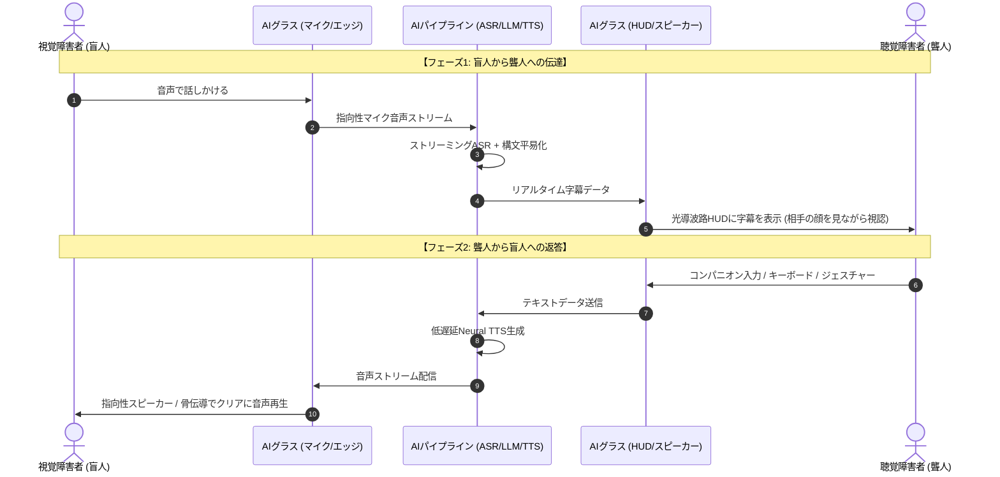

目が見えない人と、耳が聞こえない人が、通訳なしで二人きりで同じ部屋に置かれたら何が起きるでしょうか。

盲人は音声しか出力・入力できず、聾人は視覚（手話や文字）しか出力・入力できません。二人の間には、情報の入出力モダリティが完全に直交する「壁」が存在します。

スマートフォンを渡せば解決する、と多くのエンジニアは考えがちです。しかし現実には、スマートフォンのキーボード入力・画面凝視・音声読み上げの往復では、会話のテンポは壊滅します。何より、相手の顔を見て対話するという **人間的なコミュニケーションの熱量** が失われてしまいます。

中国のサイエンス実験チャンネル「荒蛋制造局」が公開した検証動画（Bilibili: BV1tP8v6pEVB）では、RayNeo（雷鸟创新）のAIスマートグラスを用い、視覚障害者と聴覚障害者が初めて第三者の通訳を介さずに対話する実験が行われました。

この動画が示したのは、単なるガジェットのデモではありません。これまでテクノロジーが越えられなかった「感覚の断絶」を、AIが実世界でどのように打破できるかを証明した鮮やかな成功事例です。

では、この成功例から私たちは何を学べるのでしょうか。そして、今後のAIプロダクト開発やマルチモーダル体験の設計に活かせるヒントは何か。その技術構造と実践的な要点を整理します。

---

## 1. 盲聾リアルタイム対話システムのスペックと全体像

まずは、この対話システムがどのような技術要素で構成されているのか、クイックリファレンスで整理します。

| 構成要素 | 採用技術・仕様例 | 解決する課題 |
| :--- | :--- | :--- |
| **ハードウェア** | RayNeo（雷鸟）等 AIスマートグラス（重量約60〜75g） | ハンズフリーでの対面対話の維持 |
| **ディスプレイ** | Micro-OLED + 光導波路（Waveguide）透過型HUD | 相手の表情と字幕の同時視認 |
| **音声入力** | ビームフォーミング・マイクアレイ + ハードウェアVAD | 騒音下での発話者の声の分離抽出 |
| **音声認識** (STT) | オンデバイスConformer / ストリーミングWhisper | 発話から文字化までの遅延短縮 |
| **言語適応** (LLM) | エッジ・クラウド協調型 軽量LLM | 手話話者向けの構文平易化・要約 |
| **音声合成** (TTS) | ニューラル低遅延TTS + 指向性スピーカー / 骨伝導 | 盲人への自然な音声フィードバック |

情報の流れをシーケンス図で見ると、2つの直交するモダリティがスマートグラスを介して相互にトランスコードされていることがわかります。



スマートフォンの画面を覗き込むスタイルと決定的に異なるのは、**視線**（Eye Contact）が切れないことです。聴覚障害者にとって、相手の口の動き（口話）や首の傾き、表情は言語情報の半分以上を占めています。HUD（Heads-Up Display）による透過型字幕表示は、相手の顔とテキストを同一視野に収めるために不可欠な要素です。

---

## 2. コア技術の深掘り：双方向マルチモーダル・パイプライン


### ① 超低遅延ストリーミングASRと「200msの壁」

対面会話において、沈黙が許容される時間は約 **200〜300ms** と言われています。レスポンスが1秒を超えると、会話は自然なやりとりではなく「トランシーバーの交信」に変貌します。

このパイプラインでは、以下の3層アーキテクチャが採用されます。

1. **ハードウェアVAD** (Voice Activity Detection):
   メガネのツルに搭載された低消費電力DSPが、発話の開始と終了を数ミリ秒で判定。無駄な無線通信と電力消費を抑えます。
2. **チャンクベースのストリーミングASR**:
   音声を最後まで待ってから認識するのではなく、160ms〜320ms単位のチャンクで順次デコードを行うストリーミング型モデル（Sherpa-ONNXやWhisperストリーミング派生）を動作させます。
3. **投機的テキストレンダリング**:
   HUD上では、未確定の推論結果を薄いグレーで先行表示し、文脈が確定した段階で白文字に確定させるUIを採用。これにより、体感遅延をほぼゼロに近づけています。

### ② 指向性オープンイヤー音響による盲人へのフィードバック

視覚障害者にとって、耳は「世界を認識するためのレーダー」そのものです。耳をカナル型イヤホンで塞いでしまうと、周囲の足音や反響音が遮断され、空間識失調や極度の恐怖感を引き起こします。

そのため、AIスマートグラスのツルに内蔵された **逆位相キャンセル付き指向性スピーカー**、または **側頭骨を介した骨伝導トランスデューサー** が必須となります。周囲の環境音を100%生かしつつ、聾人からの返答音声だけが本人の鼓膜へ直接届く音響設計が施されています。

---

## 3. なぜ成功したのか：手話と書き言葉のギャップを埋める「認知的アライメント」

この対話実験が大きな反響を呼び、実用的な対話として成立した最大の理由は、単に音声を文字化したからではありません。「**手話の文法構造と書き言葉の乖離**」という認知的ギャップにAIが切り込んだことにあります。

従来の文字起こしアプリが聴覚障害者の現場で敬遠されがちだった背景には、健聴者が気づきにくい言語学的ハードルがありました。

### 手話は「母国語（L1）」であり、書き言葉は「第二言語（L2）」

手話は、音声言語の単語を手でなぞったものではありません。独自の文法構造、空間配置、顔の表情（非手指標識）を持つ、完全に独立した自然言語です。

例えば、多くの手話体系では「**主題優位**」（Topic-Prominent）の語順が取られ、助詞（て・に・を・は）や複雑な複文構造、修飾関係は空間的な位置関係で処理されます。

幼少期から手話を第一言語として育った聾人にとって、音声言語を前提とした長い漢字混じりのテキストは、外国語の論文を読むような認知負荷を強いることになります。

```
【盲人の発話（音声言語の自然な日常会話）】
「もし良ければ、駅前のカフェで明日2時頃に会って、この前の企画について少し話しませんか？」

【単純なSTTの出力（聾人にとって認知負荷が高い長文・複文）】
「もし良ければ駅前のカフェで明日2時頃に会ってこの前の企画について少し話しませんか」

【LLMによる手話話者向けアダプテーション（要約・構造化）】
「明日 / 14:00 / 駅前カフェ / 企画の相談 / 会える？」
```

### 成功の鍵を握る「LLMによる構文リライト」

今回のシステムが真価を発揮したのは、ASRとHUDの間に「**発話のニュアンスを保ちつつ、手話話者が一瞬で把握できる視覚的構文へ変換するLLMパイプライン**」を組み込んだ点です。

敬語や前置きを削ぎ落とし、5W1Hを中心とした箇条書きに整形することで、HUD上の短い表示領域でも一瞬で意味を把握できるようになります。

「生データをそのまま流す」のではなく、**受け手の認知モデルに合わせて情報をトランスコードする**。これこそが、AIが介在することによって初めて生まれたブレイクスルーです。

---

## 4. 物理的限界をどう克服したか：スプリット・コンピューティングの実践

ウェアラブルデバイスにおけるAI実装は、ソフトウェアの理想論だけでは成り立ちません。重量・熱・バッテリーという厳しい物理法則の制約が存在します。

```
              重量 (< 70g)
                 /\
                /  \
               /    \
              /  ★  \  現実の最適解：スプリット・コンピューティング
             /        \
連続稼働 (1〜3時間) ── 放熱限界 (< 40℃)
```

1. **重量の壁**:
   日常生活で長時間装着できる限界は **60g〜75g** 程度。これを超えると鼻根部や耳介が痛み、日常的に使い続けることはできません。
2. **放熱とバッテリー持続時間**:
   メガネのツルは皮膚に密着するため、表面温度が **40℃** を超えると低温火傷のリスクが生じます。また、HUD画面の常時点灯と音声ストリーミングを連続稼働させた場合、小型バッテリーでは **1.5〜3時間程度** が実用上の限界です。NPUをフル稼働させて重いモデルをローカルで回すことは放熱・電力の両面から不可能です。
3. **スプリット・コンピューティング** (Split-Computing) の必然性:
   - **オンデバイス側**: VAD、エコーキャンセル、ディスプレイ描画、BLE通信のみを処理。
   - **ポケットの中のスマホ / クラウド側**: ASR、LLMリライト、TTSを処理。

エッジAIやスマートグラスの開発において最も頻発する落とし穴が、「ローカル完結にこだわりすぎてデバイスがカイロのように発熱し、短時間でバッテリーが尽きる」という事態です。「何をメガネのオンデバイスで処理し、何を外部デバイスやクラウドにオフロードするか」という境界線の見極めこそが、実用化の最大の分岐点となります。

---

## 5. この成功例から私たちが学べること・活かせるヒント

この対話実験の成功は、アクセシビリティ分野にとどまらず、あらゆるAIプロダクト開発やUI/UX設計に通じる実践的な示唆に満ちています。4つの視点から学びとヒントを整理します。

### ①「画面を見つめさせない」アンビエントなAI体験の設計

スマートフォンは人類に莫大な情報をもたらした反面、人間から「視線」を奪いました。対面している相手を見ず、手元の小さなガラス板を見つめながら会話する姿は、コミュニケーションの熱量を大きく損ないます。

スマートグラスの本質は、大画面を見ることではありません。「**情報が視覚の片隅に溶け込み、相手の目を見続けられること**」にあります。情報機器が身体の延長となり、黒子に徹するアンビエントな体験こそ、AIハードウェアが目指すべき理想形です。

### ② 極限の現場（アクセシビリティ）こそが最高の技術実証になる

一般的な便利機能を作っている段階では、レイテンシが少々遅れても、文字認識が多少怪しくても、ユーザーは許容してくれます。

しかし、視覚障害者や聴覚障害者にとって、モダリティ変換のエラーや遅延は「**世界との断絶**」に直結します。
- 騒音下で確実に音声を分離・抽出できるか？
- 相手の表情と字幕をラグなしに重ね合わせられるか？

妥協が一切通用しない過酷なユースケースで鍛え上げられた技術こそが、将来的にあらゆるスマートグラスのキラー機能（リアルタイム多言語翻訳やビジネス支援）へと還元される強固な基盤になります。

### ③ 単純な変換ではなく「ユーザーの認知文脈」に寄り添うAI適応

「音声を文字にすれば伝わる」という思い込みが手話話者の前で通用しなかったように、開発者側の安易な想定はしばしば現場で破綻します。

成功の鍵は、モデルの精度ベンチマークの高さを誇ることではなく、**相手が情報をどう認知し、どのような形式なら最も受け取りやすいか** を突き詰めた点にありました。音声認識とユーザーの間にLLMを挟んで表現を適応させたように、ドメインの文脈に寄り添うアライメント設計こそが、AIプロダクトの実用性を決定づけます。

### ④ エッジとクラウドの協調（スプリット）が実用性を決める

小型軽量化と高度な知能を両立させるための答えは、すべてをデバイス内に詰め込むことではありませんでした。

軽量なオンデバイス処理でユーザーインターフェースとセンシングを支え、重厚なマルチモーダル処理を外部に委託する。このスプリット・コンピューティングの美しい役割分担は、今後登場するあらゆるエッジAIデバイスの設計において、最も直接的で再現性の高いヒントとなります。

---

## 6. まとめ

「目が見えない」ことと「耳が聞こえない」こと。

かつては超えられなかったこの大きな感覚の断絶が、AIグラスという小さなデバイスによって埋められようとしています。

テクノロジーが単なるエンタメや効率化の道具にとどまらず、人の身体的制約を取り払い、孤独を解消するために使われる。これこそが、AI技術が社会に果たすべき最も美しい価値の一つです。

今回の成功例が示したアプローチは、私たちが次のAIプロダクトを構想する上での確かな道標となるはずです。

あなたは、AIとウェアラブルデバイスの組み合わせが、今後どのような「人間同士の壁」を壊していくと思いますか？ ぜひコメント欄でご意見をお聞かせください。
