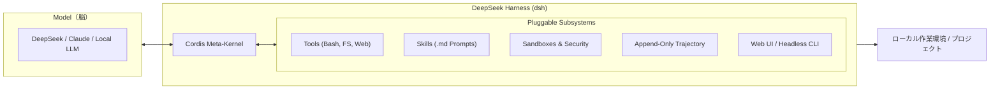

2026年8月17日、DeepSeek APIの価格改定（ピーク・オフピーク制の導入）が始まりました。

入力単価の上昇に身構えた開発者も多いかと思いますが、このタイミングでDeepSeek公式からオープンソースとして無料公開（MITライセンス）されたのが、Agent実行フレームワークである **DeepSeek Harness**（通称：dsh）です。

Claude Codeをはじめとする自律コーディングAgentが注目を集める一方で、「巨大なブラックボックスで中身が読めない」「ツールの追加やカスタマイズがしづらい」「トークン消費が激しい」といった課題に直面したことはないでしょうか。

DeepSeek Harnessは、北京大学との共同研究から生まれたメタフレームワーク「**Cordis**」をベースに設計されており、「**すべてがプラグイン（Everything as a Plugin）**」という徹底したモジュール化思想を貫いています。

この記事では、dshのアーキテクチャの根幹から、用途別に用意された4つの実行モード、Web UIでの操作感、そしてキャッシュ率80%超を叩き出すコスト最適化の仕組みまでを徹底的に解剖します。

---

## 30秒で把握するDeepSeek Harness（dsh）基本スペック

| 項目 | 詳細 |
|------|------|
| **正式名称** | DeepSeek Harness（CLI: `dsh`） |
| **開発元** | DeepSeek AI（公式リポジトリ: `deepseek-ai/deepseek-harness`） |
| **カテゴリ** | コーディングAgent開発・実行ハーネス（Agent OS基盤） |
| **コア設計思想** | Everything as a Plugin（一切皆插件） |
| **基盤メタフレームワーク** | Cordis（時空的可合成性を持つマイクロカーネル） |
| **主要実行モード** | Standard / PTC / Minimal / Creation の4モード |
| **ライセンス** | MIT（商用利用・改変自由の完全オープンソース） |
| **インターフェース** | ローカルWeb UI（デフォルト `:3080`） / Headless CLI |
| **状態管理・追跡** | Append-only（追記専用）セッションログによる完全再現性 |

---

## コア思想：「Agent = Model ＋ Harness」への転換

従来のAgent開発は「プロンプトエンジニアリング」と「モデルの性能」に依存しがちでした。しかしDeepSeekは、Agentを次のように定義しています。

> **Agent ＝ Model（脳）＋ Harness（外骨格）**



LLM単体は「テキストを生成するだけの存在」です。ファイルシステムを読み書きし、Shellコマンドを実行し、状態を管理して安全に目的を達成させる役割を担うのが **Harness**（ハーネス）です。

モデルに依存しすぎず、実行基盤側をオープンで強固に構築することで、特定のベンダーに縛られない（Anti-Vendor Lock-in）柔軟な運用が可能になります。

---

## アーキテクチャの心臓部：Cordisと「時空的可合成性」

dshの最大の特徴は、基盤に **Cordis** を採用している点です。

Cordisは元々複雑なボットやモジュール型システムのために研究されてきたメタフレームワークで、論文（*A Programming Paradigm for Spatiotemporal Composability*）で提唱された「**時空的可合成性（Spatiotemporal Composability）**」を実装しています。

```
┌────────────────────────────────────────────────────────┐
│                   DeepSeek Harness                     │
│                                                        │
│  ┌──────────────────────────────────────────────────┐  │
│  │             Cordis Meta-Kernel                   │  │
│  └───────┬──────────────┬──────────────┬────────────┘  │
│          │              │              │               │
│     [空間的合成]   [時間的合成]   [リアクティブ]       │
│     動的プラグイン    副作用の自動    依存関係の        │
│     マウント/解除    ロールバック    リアクティブ解決  │
│          │              │              │               │
│  ┌───────┴──────────────┴──────────────┴────────────┐  │
│  │ Models │ Tools │ Skills │ Sandbox │ Session │ UI │  │
│  └──────────────────────────────────────────────────┘  │
└────────────────────────────────────────────────────────┘
```

1. **空間的可合成性（Spatial Composability）**:
   ツール、スキル、モデル接続、サンドボックス、セッション保存、Web UIに至るまで、すべての機能が独立したプラグインとして実行時に動的マウント・アンマウントされます。
2. **時間的可合成性（Temporal Composability）**:
   プラグインがアンマウントされた際、そのプラグインが残した一時状態やリスナーなどの **副作用（Side Effects）を自動ロールバック** します。「拡張機能を入れたらシステムが汚れて元に戻らない」という問題を根本から防ぎます。

---

## 用途に応じた4つの実行モード

dshには、あらかじめ厳選されたプラグインセットをロードする4つの動作モードが用意されています。

```
┌─────────────────────────────────────────────────────────────────┐
│                    dsh 4つの実行モード                          │
├─────────────────┬───────────────────────────────────────────────┤
│ 1. Standard     │ フル機能のコーディングAgent（通常開発・リサーチ）│
├─────────────────┼───────────────────────────────────────────────┤
│ 2. PTC          │ Programmatic Tool Calling（コード生成による一括呼出）│
├─────────────────┼───────────────────────────────────────────────┤
│ 3. Minimal      │ Shell + 最小エディタのみ（ベンチマーク・ノイズ排除） │
├─────────────────┼───────────────────────────────────────────────┤
│ 4. Creation     │ 開発者モード（プラグイン開発・実験・モード自作）  │
└─────────────────┴───────────────────────────────────────────────┘
```

### 1. Standard（標準モード）
一般的な日常開発向けのフル装備モード。ファイル編集、永続Shell、Web検索、計画立案（Planning）、サブエージェント呼び出しなど、すべての標準プラグインが有効化されます。

### 2. PTC（Programmatic Tool Calling / プログラム化ツール呼び出し）
複雑な一連の処理を行う際、モデルがTypeScriptのプログラムコードを生成し、**複数回のツール呼び出しを1回の実行ループにまとめて完結** させるモードです。
ステップごとの無駄な往復（ラウンドトリップ）とトークン消費を大幅に削減できます。

### 3. Minimal（極簡モード）
余計なツールやスキルを一切読み込まず、**永続Bash Shellと最小ファイルエディタのみ** を提供するモードです。
モデル自体の純粋な推論・コーディング能力をベンチマーク測定する際や、プロンプトのコンテキストを極限までクリーンに保ちたい場合に威力を発揮します。

### 4. Creation（クリエイターモード）
実行中のdsh内部状態をリアルタイムで検査し、メモリ上でCordisプラグインの着脱や動作確認を行えるモードです。
自作プラグインの開発や、新しいカスタムプリセットを作成する際のメイン環境になります。

---

## 画面構成と操作体験：Web UI & CLI

dshはCLIだけでなく、直感的に扱えるローカルWeb UI（`http://127.0.0.1:3080`）を標準搭載しています。

### 1. Web UI の実際の実行画面


*▲ 実際のdsh Web UI画面。上部に「Standard mode」やセッションログDLボタン、下部に「deepseek-v4-flash」と「Cache hit 89%」のリアルタイムメトリクスが表示されている*

画面レイアウトの要点は以下の通りです：
- **上部ヘッダー**: 実行中のモード（`Standard mode`）の確認や、右上の `Session log ⤓` ボタンからセッションログをワンクリックでローカル保存できます。
- **タブ切り替え**: 会話形式の `Chat` と、思考ステップツリーを可視化する `Trajectory` を即座に切り替え可能。
- **成果物の可視化**: 生成・編集されたファイル（画像では `Produced sort.py`）がバッジ形式で整理され、変更箇所へすぐにアクセスできます。
- **下部メトリクスバー**: 使用モデル（`deepseek-v4-flash`）、権限（`Workspace Write`）に加え、推論速度（`203 tok/s`）、消費トークン数（`Input 36.6K tok · Output 1.3K tok`）、そしてキャッシュヒット率（**Cache hit 89%**）がリアルタイムにモニタリングされます。

### 2. Trajectory（実行軌跡）による完全追跡と再現性


*▲ Trajectoryタブの実行画面。上部にInput/Model/Toolsのタイムラインバー、左側に思考・Tool呼び出し（pwsh, write等）のステップ一覧、右側に各ステップのPayload・Result・Timing詳細が表示される*

Trajectory画面を開くと、Agentがタスクを達成するまでのプロセスがミリ秒単位で完全に可視化されます。

- **タイムラインバー（上部）**: `Input`（青）、`Model`（推論・紫）、`Tools`（ツール実行・オレンジ）の所要時間とターン推移がガントチャートのように直感的に把握できます。
- **ステップツリー（左側）**: ディレクトリ確認（`pwsh pwd`）→ 思考プロセス → ファイル書き込み（`write sort.py`）→ 実行テスト（`pwsh python sort.py`）→ 完了報告という一連の自律アクションが1ステップずつ記録されています。
- **詳細インスペクタ（右側）**: 任意のステップをクリックすると、`Summary` / `Payload`（送信引数） / `Result`（実行出力） / `Schema`（ツール定義） / `Timing`（実行時間）を詳細に監査・デバッグできます。

裏側ではすべて追記専用（Append-only）のJSONL形式で記録されており、右上の `Session log ⤓` からいつでもダウンロードしてローカルで監査やリプレイが可能です。

---

## 8/17価格改定とdshの強み：キャッシュ率80%超の秘密

冒頭でも触れたとおり、2026年8月17日よりDeepSeek APIはピーク・オフピーク制に移行しました。

| モデル名 | 時間帯 | キャッシュヒット時 入力（/1M） | キャッシュミス時 入力（/1M） | 出力（/1M） |
|---|---|---|---|---|
| **deepseek-v4-flash** | オフピーク | $0.007 | $0.22 | $0.66 |
| | ピーク | $0.014 | $0.44 | $1.32 |
| **deepseek-v4-pro** | オフピーク | $0.022 | $0.66 | $1.98 |
| | ピーク | $0.044 | $1.32 | $3.96 |

表を見ると一目瞭然ですが、**キャッシュヒット時の入力コストはキャッシュミス時の約30分の1**（97%オフ）です。

dshは設計段階からContext Cachingの特性を念頭に置いて構築されています。
システムプロンプト、ツールスキーマ定義、プロジェクト概要などの「静的コンテキスト」をプロンプトの先頭（Prefix）に厳密に固定し、変動するユーザー指示や実行結果だけを後方に追加します。

この設計により、複数ターンのタスクを実行してもPrefixのキャッシュが途切れず、**実測でのプロンプトキャッシュヒット率は80%〜85%台** を維持できます。トークン単価の引き上げ後も、実際の請求額を非常に低く抑えられる理由がここにあります。

---

## 主要Agentハーネスとの比較

| 項目 | DeepSeek Harness (dsh) | OpenHarness | Claude Code (CLI) |
|---|---|---|---|
| **アーキテクチャ** | Cordis メタフレームワーク | 軽量 Python ハーネス | モノリシック CLI |
| **拡張思想** | **Everything as a Plugin** | モジュール直接記述 | MCP Server / Hooks |
| **動作モード** | **4モード（Standard/PTC等）** | 単一実行ループ | 単一実行ループ |
| **コード規模** | マイクロカーネル＋疎結合プラグイン | 約1.1万行 (Python) | 約51万行 (TypeScript) |
| **ライセンス** | **MIT（完全OSS）** | MIT（完全OSS） | プロプライエタリ |
| **UI** | **Web UI (`:3080`) + Headless** | CLI + チャットボット | ターミナル TUI |
| **Cache最適化** | **ネイティブ最適化（80%+実測）** | プロバイダ依存 | Claude API特化 |
| **可観測性** | **構造化Trajectory + Web再生** | テキストログ | ローカルログ |

---

## メリットと制約事項

### メリット
- **高い拡張性と疎結合性**: Cordis基盤により、本体コードを1行も改変せずに自作ツールやサブエージェントを追加可能。
- **キャッシュ効率による低コスト**: 80%超のキャッシュヒット率により、値上げ後も気兼ねなくAgentを回せる。
- **安心の可観測性**: 全ステップが追跡可能なため、ブラックボックス化による不安や誤動作のリスクを最小化できる。
- **マルチモード対応**: ベンチマーク用のMinimalや効率重視のPTCなど、用途に合わせて環境を切り替えられる。

### 制約・留意点
- **v0.1 開発者プレビュー**: 現在は初期プレビュー段階であり、プラグインAPI仕様の調整が行われる可能性がある。
- **プラグインのエコシステム**: コミュニティ製プラグインの数はまだ立ち上がり段階（自作・カスタマイズが中心）。
- **API混雑時の影響**: ピーク時間帯におけるDeepSeek API自体の混雑・レート制限には注意が必要。

---

## 5分で試せるクイックスタート

Node.js環境があれば、すぐにdshを起動できます。

### 1. Web UI の起動

```bash
# npxで直接起動（インストール不要）
npx @deepseek-ai/dsh web

# またはグローバルインストールして起動
npm install -g @deepseek-ai/dsh
dsh web --port 3080
```

起動後、ブラウザで `http://localhost:3080` を開きます。

### 2. ソースコードからの起動と開発

GitHubリポジトリをクローンして実行することも可能です。

```bash
git clone https://github.com/deepseek-ai/deepseek-harness.git
cd deepseek-harness
pnpm install
pnpm build
pnpm start:web
```

### 3. API Key の設定と実行

```bash
export DEEPSEEK_API_KEY="sk-xxxxxxxxxxxxxxxxxxxxxxxx"

# CLIからMinimalモードで実行する場合の例
dsh run --mode minimal "npm test を実行してエラー箇所を修正してください"
```

---

## まとめと次回予告

DeepSeek Harness（dsh）は、単なるツールの1つにとどまらず、モデル中心から「**外骨格（Harness）中心のエンジニアリング**」へのシフトを具現化した実践的なフレームワークです。

キャッシュ率80%超による高い経済性と、Cordisによる「Everything as a Plugin」の拡張性は、今後のAgent開発基盤のスタンダードになる可能性を秘めています。

次回は、dshの最大の強みである「**自作プラグイン開発入門：Cordisを使ったカスタムツールの実装とdsh-pluginの公開手順**」をお届けします。社内APIや独自ツールをdshに接続するハンズオンを詳しく解説します。

dshを試してみた感想や、作ってみたいプラグインのアイデアがあれば、ぜひコメント欄でお知らせください！
