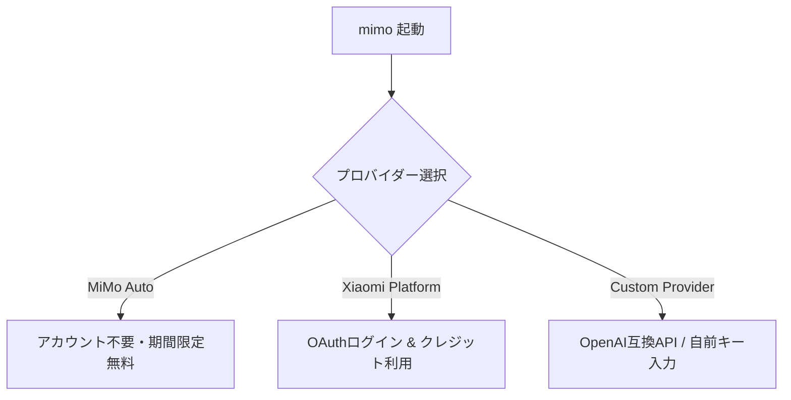
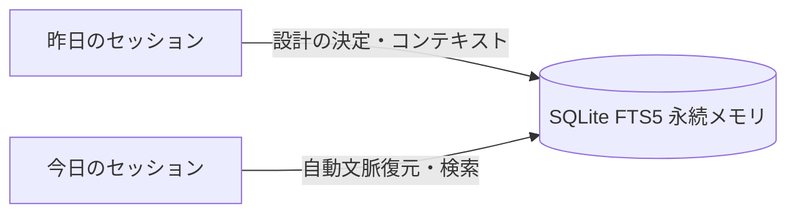

AIエージェントをローカルで動かしてコーディングさせたいけれど、「APIキーの取得やアカウント登録が面倒」「トークンコストが心配で気軽に試せない」と躊躇していませんか？

そんな開発者に朗報です。2026年6月、Xiaomi（シャオミ）からオープンソースのターミナルネイティブAIコーディングエージェント**「MiMo Code（ミモ・コード）」**がリリースされました。

最大の特徴は、**「アカウント作成不要（No Login）」で、起動後すぐに無料で利用できる公式チャンネルが用意されている点**です。さらに、AIエージェントの弱点である「物忘れ（文脈の喪失）」を解決する永続メモリを搭載しています。

> [!WARNING]
> **無料利用は永久ではありません。**
> 現在「MiMo Auto」チャンネル経由で提供されている内蔵モデル **MiMo-V2.5** は、**期間限定での無料開放**となっています。将来的に有料化や制限が導入される可能性があるため、今のうちにその実力を体験しておくことをおすすめします。

本記事では、この注目の次世代AI開発ツール「MiMo Code」の機能、内蔵モデル「MiMo-V2.5」の実力、そしてインストールから使い方までを徹底解説します。

---

## 基本情報クイックリファレンス

| 項目 | 内容 |
|------|------|
| **開発元** | Xiaomi (シャオミ) / オープンソースコミュニティ |
| **ライセンス** | **MIT License** (完全商用利用・改変可) |
| **ベース技術** | OpenCode (フォーク元) |
| **接続モデル** | 内蔵モデル **MiMo-V2.5**（期間限定無料） / OpenAI互換API / Claude Code |
| **アカウント登録** | **不要**（「MiMo Auto」選択時, ログインなしで即利用可） |
| **利用料金** | **期間限定無料**（MiMo Auto チャンネル利用時） |
| **対応OS** | macOS / Linux / Windows (PowerShell) |

---

## TUI（ターミナルUI）画面イメージ

MiMo Codeを起動すると、以下のようなシンプルで直感的な TUI（ターミナルUI）が表示されます。


*起動画面。中央下部には「MiMo Auto (MiMo-V2.5 期間限定無料)」と表示されており、アカウント不要ですぐに利用できることが分かります。*

---

## 内蔵モデル「MiMo-V2.5」の紹介

MiMo Codeの無料チャンネルで提供されている **MiMo-V2.5** は、Xiaomiが開発したコーディング特化型の高品質なマルチモーダルLLMです。

### MiMo-V2.5 の主な特徴：
* **高いコーディング＆推論能力**: プログラミング言語の構文理解、バグの検出、複雑なロジックのリファクタリングにおいて、商用の主要モデルに匹敵するスコアを示します。
* **広いコンテキストウィンドウ**: 巨大なコードベースの解析に対応するため、大量のコンテキストを一度に読み込んで処理することが可能です。
* **マルチモーダル対応**: テキストだけでなく、画像（UIデザインのスクリーンショットや設計図など）を入力として受け取り、それに基づいたコード生成やフロントエンドの実装を行うことができます。
* **ゼロ設定で利用可能**: 認証キーの設定やOAuthログインの手慢をかけずに、モデルへの接続が即座に最適化されています。

---

## 核心機能と3つの強み

MiMo Codeが他のCLIコーディングアシスタント（Claude Code等）と一線を画すポイントは以下の3点です。

### 1. 「MiMo Auto」によるゼロ設定・アカウント不要アクセス
初回起動時に接続プロバイダーを設定する際、**「MiMo Auto (free, no login)」**を選択できます。これにより、メールアドレスやGitHub連携などのアカウント登録を一切行うことなく、Xiaomiがホストする強力なマルチモーダルモデル「MiMo-V2.5」を無料で利用可能です。



### 2. 健忘症を克服する「永続メモリ（Persistent Memory）」
AIエージェントを使いこなす上で最大の障壁となるのが、セッションが切れたときに過去の文脈や設計の決定事項を忘れてしまう「AI Amnesia（AIの健忘症）」です。

MiMo Codeは、ローカルに**SQLite FTS5（全文検索）を内蔵した永続メモリシステム**を備えています。
これにより、別の作業フォルダへ切り替えたり、ターミナルを再起動したりした後でも、プロジェクトの全体構造や以前に行った決定、実装の意図をエージェントが記憶し続けます。



### 3. 長時間タスク（Long-Horizon Task）への適応力
200ステップを超えるような複雑で長時間のプログラミングタスク（リファクタリング、バグ修正、テスト駆動開発など）において、自律的に思考し、状態を管理する能力に優れています。

---

## クイックセットアップガイド

インストールはターミナルからワンコマンドで完了します。

### 1. インストール

使用しているOSに合わせて、以下のコマンドを実行してください。

* **macOS / Linux:**
  ```bash
  curl -fsSL https://mimo.xiaomi.com/install | bash
  ```

* **Windows (PowerShell):**
  ```powershell
  powershell -ep Bypass -c "irm https://mimo.xiaomi.com/install.ps1 | iex"
  ```

* **NPM (クロスプラットフォーム):**
  ```bash
  npm install -g @mimo-ai/cli
  ```

### 2. 初期設定
インストール後、プロジェクトのルートディレクトリに移動し、`mimo` コマンドを実行します。

```bash
cd /path/to/your-project
mimo
```

初回起動時に、以下のようなプロバイダー選択画面が表示されます。

```text
? Select your AI provider:
> MiMo Auto (free, no login)
  Xiaomi MiMo Platform (OAuth Login)
  Claude Code Import
  Custom OpenAI-Compatible Provider
```

ここで **「MiMo Auto (free, no login)」** を選択すれば、即座に準備完了です！

### 3. プロジェクトの初期化
エージェントにコードベースを正確に把握させるため、最初に `/init` コマンドを実行することをおすすめします。

```text
mimo > /init
```

これにより、プロジェクトルートに設定情報や `AGENTS.md`（エージェントへの開発ルール・指示書）が生成され、エージェントがより文脈に沿った正確な提案を行えるようになります。

---

## 主要なコマンドと活用法

MiMo Codeは対話式のTUI（ターミナルUI）を提供しており、チャット内でスラッシュから始まるコマンドを使って処理を制御できます。

* **`/goal [タスク]`**: 自律走行モード。指定された目標に向けて、ファイルの読み書き、ターミナルコマンドの実行、検証をエージェントが自律的に繰り返します。
* **`/compose [指示]`**: 計画立案モード。複雑なタスクに対して、まずは「実装計画」を立て、ユーザーのレビューを挟んでから段階的にコーディングを実行します。
* **`/dream [テーマ]`**: 設計・ブレインストーミングモード。コードを直接書き換える前に、アーキテクチャのアイデア出しやディスカッションをエージェントと行えます。
* **`/distill`**: タスクの要約モード。現在までの対話や修正内容を整理し、開発の進捗をクリーンアップします。

---

## まとめ：まずは無料期間中に体験してみよう

アカウント不要で手軽に試せる「MiMo Code」は、AIコーディングエージェントの導入障壁を限りなくゼロにした画期的なツールです。無料枠は期間限定ですので、気になる方はお早めにお試しください。

- **クレジットカードやAPIキーの手間を省いて、今すぐエージェントを試したい人**
- **セッションごとにコンテキストが失われるのに不満を感じていた人**
- **ローカルでのテスト実行やコマンド実行を伴う自律的な開発を体験したい人**

これらに当てはまる方は、ぜひ一度ターミナルにインストールして、その手軽さと強力な記憶力を体験してみてください！

---

**皆さんはもうMiMo Codeを体験しましたか？**
「MiMo Autoでの動作感」や「永続メモリによる開発効率の変化」など、ぜひコメント欄で皆さんの感想を教えてください！ 🤖
